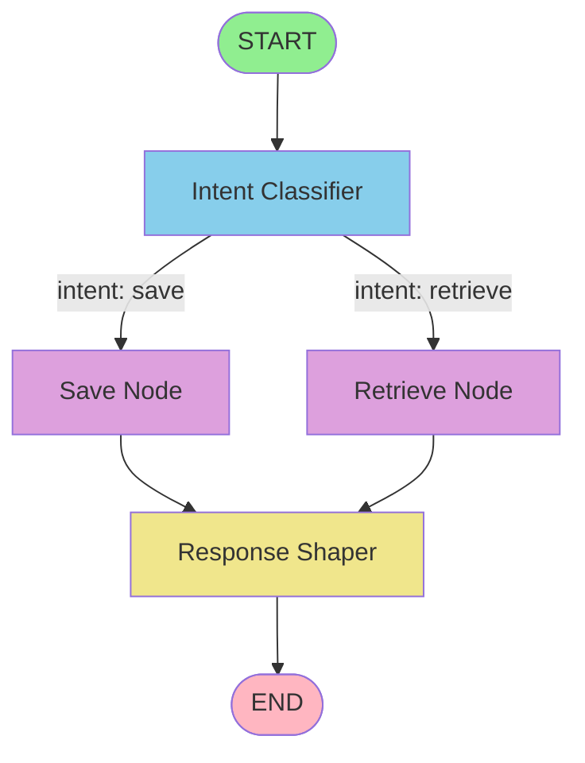
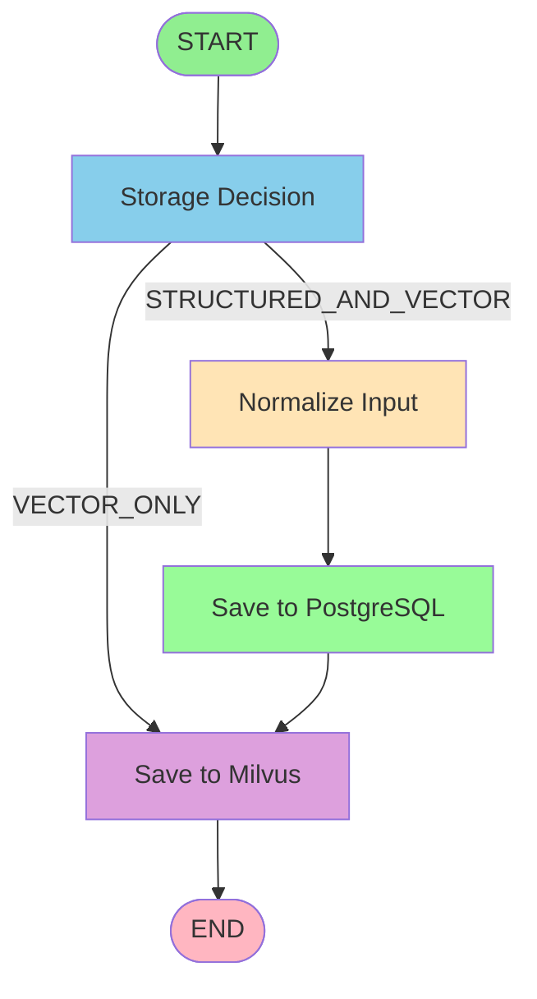
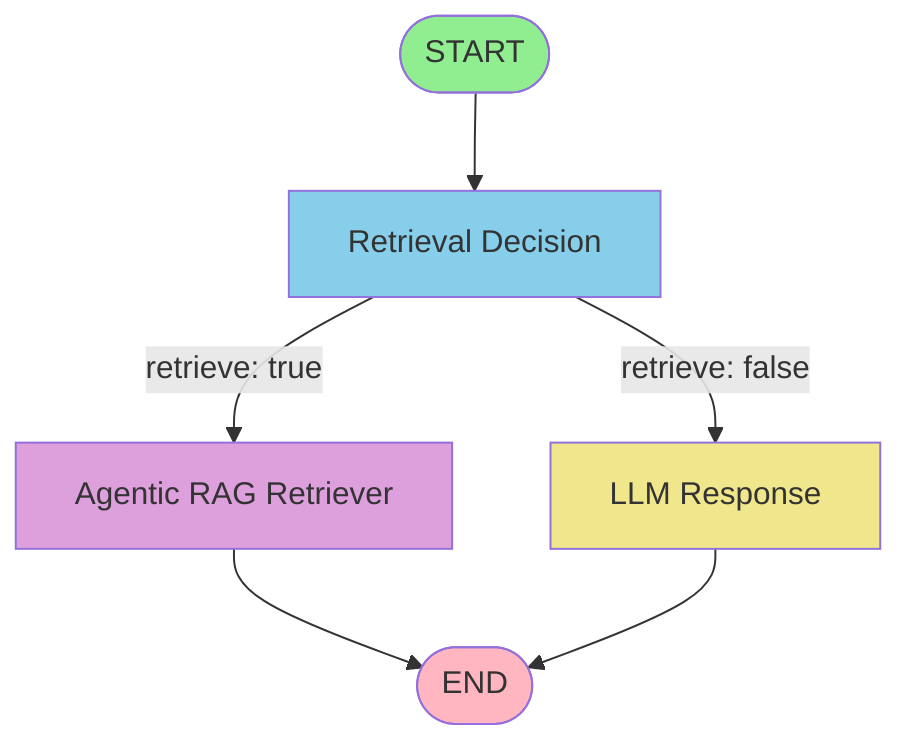
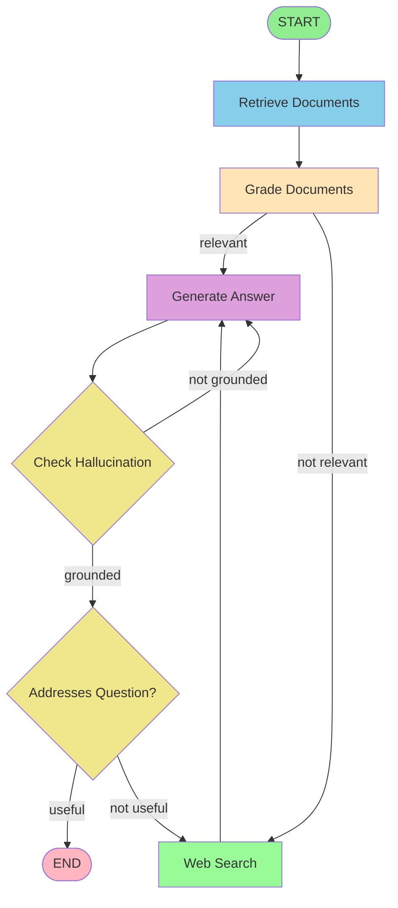
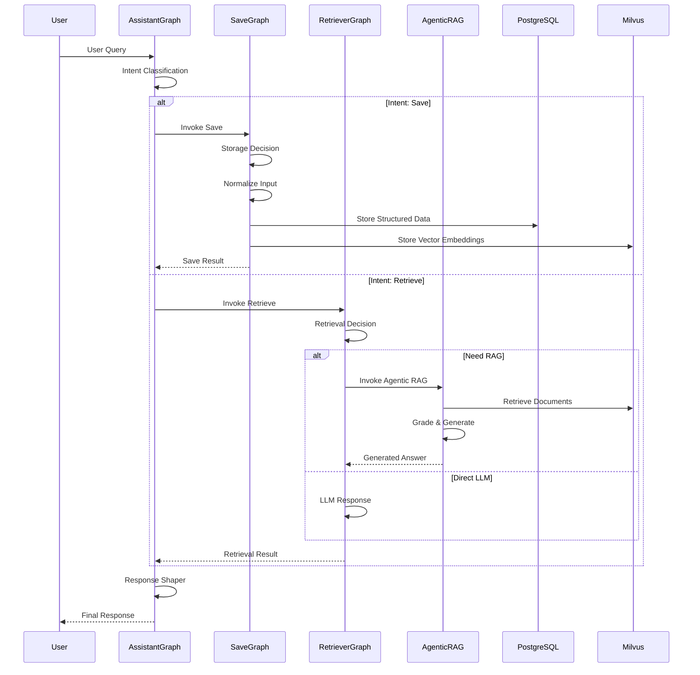

# Cortex Architecture

This document describes the overall architecture of the Cortex system, which is built using LangGraph for multi-agent workflow orchestration.

## Overview

Cortex is a multi-graph LangGraph application that processes user queries through an intent-based routing system. The system consists of one main graph (Assistant Graph) and three subgraphs (Save Graph, Retriever Graph, and Agentic RAG Retriever Graph).

## Architecture Diagram

### Main Assistant Graph

The Assistant Graph is the main entry point for all user requests. It classifies user intent and routes to appropriate subgraphs.

**Components:**
- **Intent Classifier Node**: Determines whether the user wants to save or retrieve information
- **Save Node**: Invokes the Save Graph to process and store data
- **Retrieve Node**: Invokes the Retriever Graph to fetch and process information
- **Response Shaper**: Formats the final response to the user

---

### Save Graph

The Save Graph handles data normalization and storage routing to both structured (PostgreSQL) and vector (Milvus) databases.

**Components:**
- **Storage Decision Node**: Determines the storage strategy based on data type
- **Normalize Input Node**: Normalizes and structures the input data
- **Save PostgreSQL Node**: Stores structured data in PostgreSQL
- **Save Milvus Node**: Stores vector embeddings in Milvus

**Storage Strategies:**
- `STRUCTURED_AND_VECTOR`: Data requires both structured storage and vectorization
- `VECTOR_ONLY`: Data only needs to be stored as vector embeddings

---

### Retriever Graph

The Retriever Graph determines whether to use the Agentic RAG Retriever or provide a direct LLM response.

**Components:**
- **Retrieval Decision Node**: Determines if RAG retrieval is needed
- **Agentic RAG Retriever Node**: Invokes the Agentic RAG Retriever Graph for complex retrieval
- **LLM Response Node**: Generates direct LLM response without retrieval

---

### Agentic RAG Retriever Graph

The Agentic RAG Retriever Graph implements a sophisticated retrieval-augmented generation workflow with document grading, web search fallback, and hallucination checking.

**Components:**
- **Retrieve Node**: Retrieves relevant documents from the vector store
- **Grade Documents Node**: Evaluates document relevance to the query
- **Generate Node**: Generates an answer based on retrieved documents
- **Web Search Node**: Performs web search when documents are insufficient
- **Hallucination Checker**: Verifies the generation is grounded in documents
- **Answer Grader**: Checks if the answer addresses the original question

**Workflow Logic:**
1. Documents are retrieved and graded for relevance
2. If documents are relevant, generation proceeds
3. If not relevant, web search is triggered for additional context
4. Generated answers are checked for hallucinations
5. If hallucinating, regeneration is triggered
6. If grounded but not useful, web search is triggered
7. Process continues until a useful, grounded answer is produced

---

## Data Flow

---

## Graph Images

The following graph images are available in the `graph_images/` folder:

1. **assistant_graph.png** - Main assistant graph visualization
2. **save_graph.png** - Save graph visualization
3. **retriever_graph.png** - Retriever graph visualization
4. **agentic_retriever_graph.png** - Agentic RAG retriever graph visualization

---

## Technology Stack

- **LangGraph**: Workflow orchestration and state management
- **LangChain**: LLM integration and prompt management
- **PostgreSQL**: Structured data storage
- **Milvus**: Vector database for embeddings
- **Redis**: Caching and session management
- **Docker**: Containerization and service orchestration

---

## Key Features

1. **Intent-Based Routing**: Automatic classification and routing of user queries
2. **Multi-Storage Strategy**: Flexible storage to both structured and vector databases
3. **Agentic RAG**: Sophisticated retrieval with quality checks and web search fallback
4. **Hallucination Prevention**: Built-in validation to ensure grounded responses
5. **Modular Design**: Clean separation of concerns with subgraph composition
